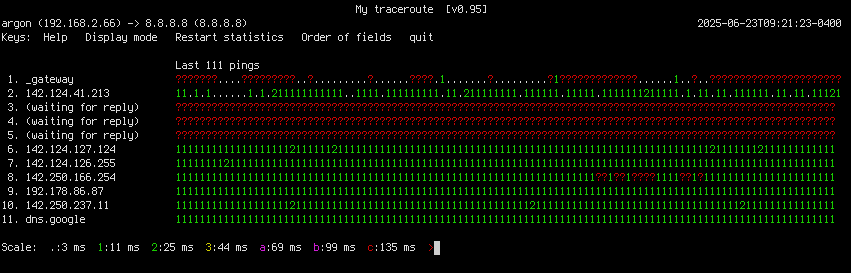

+++
title = 'mtr braille graph'
date = '2025-06-23T08:34:19-04:00'

author = "bartman"
authorTwitter = "barttrojanowski"
cover = ""
tags = ["mtr", "linux", "shell", "net"]
categories = ["blog"]
keywords = ["mtr", "linux", "shell"]
description = ""
showFullContent = false
readingTime = true
hideComments = false

draft = true
+++

## mtr braille graph

I often monitor network stability with `mtr`, which can show a time series
of how the network is doing at different hops between two endpoints.  I recently
made an improvement to `mtr` that shows the time series as a graph using braille
characters.

<!--more-->

The Unicode character set has many glyphs, including many
[block drawing characters](https://en.wikipedia.org/wiki/Box-drawing_characters).
Within those there are two types of braille pattern blocks: 6-dots and 8-dots,
the latter of which has a 4x2 matrix of dots `⣿`, giving us 256 combinations of dots.


I had played with braille characters before in my [blot](https://github.com/bartman/blot/)
plotting library.  I had more leeway there, since the canvas was limited by
the size of the terminal.  This time I only have one line of text.

If you're not familiar, `mtr` has multiple modes, including "display mode 2", which
already displays a series of color codes alphanumeric characters to indicate the
round trip time to the hop along the routed being traced.  It looks like this...

```sh
❯ mtr -t 8.8.8.8 --displaymode=2
```


Adding braille characters has two major wins for `mtr` display:
1. twice the history on the horizontal dimension
2. can show relative latency in vertical dimension

```sh
❯ mtr -t 8.8.8.8 --displaymode=3
```


This change has been merged
([422f4a0](https://github.com/traviscross/mtr/commit/422f4a08f34c755cc5a281d3ebc1286c31a661be))
into `mtr`, but I don't think it's part of any OS release. So you can build it yourself...

1. using docker

    First, grab this [Dockerfile](Dockerfile), and optionally edit if.

    Then from the directory containing the `Dockerfile`, run...

    ```sh
    ❯ docker build -t mtr-build .
    ❯ docker run -it mtr-build /mtr/mtr -t 8.8.8.8 --display=3
    ```

2. manual (Debian)
    ```sh
    ❯ sudo apt update
    ❯ sudo apt install git build-essential autoconf automake libncurses-dev libjansson-dev libcap-dev pkg-config locales
    ❯ git clone 
    ❯ git clone https://github.com/traviscross/mtr.git /mtr
    ❯ ./bootstrap.sh
    ❯ ./configure
    ❯ make
    ❯ ./mtr -t 8.8.8.8 --display=3
    ```
